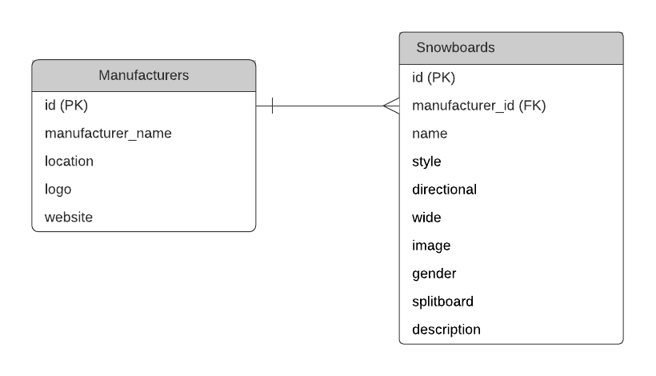
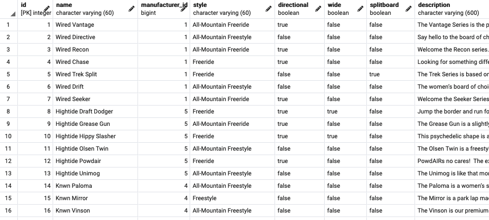

# Canadian Snowboards

This is a project showcasing snowboards manufactured in Canada.
The project was built using React, GraphQL, and AWS (PostgreSQL).

See the [Live Project](https://canadiansnowboards.netlify.app) here.

## Internal API

Canadian Snowboards uses an internal API using GraphQL to access data from the database.

The database is [accessible here](https://canadiansnowboards-server.herokuapp.com/graphql) (GraphiQL is enabled).

The repository for the API is [located here](https://github.com/henryliang2/snowboards-be).

## Data Storage

No external API was used for this project - all data is stored using Amazon RDS.
Canadian Snowboards uses PostgreSQL for data storage. See the database schema and sample rows below:

## Technologies

React, Express, GraphQL, SQL, AWS (PostgreSQL)
